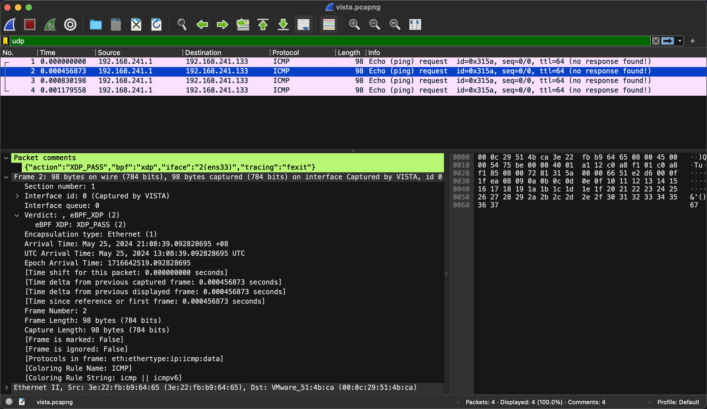

# vista: skb and socket tracing tool

`vista` is a `bpf-(2)` based tool for tracing network skbs and sockets.

## Running

### Requirements

`vista` requires >= 5.3 kernel to run. For `--output-skb` >= 5.9 kernel is required. For `--backend=kprobe-multi` >= 5.18 kernel is required.

`debugfs` has to be mounted in `/sys/kernel/debug`. In case the folder is empty, it can be mounted with:

```bash
mount -t debugfs none /sys/kernel/debug
```

The following kernel configuration is required.

|           Option         | Backend      |                   Note                               |
| ------------------------ | -------------|----------------------------------------------------- |
| CONFIG_DEBUG_INFO_BTF=y  | both         | available since >= 5.3                               |
| CONFIG_KPROBES=y         | both         |                                                      |
| CONFIG_PERF_EVENTS=y     | both         |                                                      |
| CONFIG_BPF=y             | both         |                                                      |
| CONFIG_BPF_SYSCALL=y     | both         |                                                      |
| CONFIG_FUNCTION_TRACER=y | kprobe-multi | /sys/kernel/debug/tracing/available_filter_functions |
| CONFIG_FPROBE=y          | kprobe-multi | available since >= 5.18                              |

You can use `zgrep $OPTION /proc/config.gz` to validate whether option is enabled.

### Usage

```bash
$ ./vista --help
Usage: ./vista [options] [pcap-filter]
    Available pcap-filter: see "man 7 pcap-filter"
    Available options:
      --all-kmods                      attach to all available kernel modules
      --filter-addr string             filter IP address
      --filter-ifname string           filter skb ifname in --filter-netns (if not specified, use current netns)
      --filter-kprobe-batch uint       batch size for kprobe attaching/detaching (default 10)
      --filter-netns string            filter netns ("/proc/<pid>/ns/net", "inode:<inode>")
      --filter-port uint16             filter port
      --filter-protocol string         filter protocol, tcp, udp, icmp, empty for any
      --filter-sk-func string          filter kernel sk functions to be probed by name (exact match, supports RE2 regular expression)
      --filter-sk-mark uint32          filter sk mark
      --filter-skb-drop-stack          trace kfree_skb and print skb drop stack
      --filter-skb-func string         filter kernel skb functions to be probed by name (exact match, supports RE2 regular expression)
      --filter-skb-mark uint32         filter skb mark
      --filter-tcp-lifetime duration   filter TCP lifetime greater than or equal to the given duration (e.g., 100ms, 1s, 1m)
      --filter-trace-iptables          trace iptables
      --filter-trace-sk                trace sock
      --filter-trace-skb               trace skb
      --filter-trace-tc                trace TC bpf progs
      --filter-trace-tcp               trace tcp socket lifetime
      --filter-trace-xdp               trace XDP bpf progs
      --filter-track-skb               trace a packet even if it does not match given filters (e.g., after NAT or tunnel decapsulation)
  -h, --help                           display this message and exit
      --kernel-btf string              specify kernel BTF file
      --kmods strings                  list of kernel modules names to attach to
      --kprobe-backend string          Tracing backend('kprobe', 'kprobe-multi'). Will auto-detect if not specified.
      --output-file string             write traces to file
      --output-iptables                print iptables
      --output-limit-lines int         exit the program after the number of events has been received/printed
      --output-meta                    print skb metadata
      --output-sk                      print sock
      --output-skb                     print skb
      --output-stack                   print stack
      --output-tcp                     print TCP
      --output-tuple                   print L4 tuple
      --pcap-file string               write packets to pcap file, only work with --filter-trace-xdp/--filter-trace-tc
      --pcap-mode strings              pcap mode, can be 'entry' and/or 'exit', only work with --pcap-file. Default is 'entry' and 'exit'. 'entry' is to capture packet before BPF prog, 'exit' is to capture packet after BPF prog.
      --pcap-snaplen uint16            snapture length of packet for pcap (default 256)
      --timestamp string               print timestamp per event ("relative", "absolute", "none") (default "none")
      --version                        show vista version and exit
```

The `--filter-skb-func` switch does an exact match on function names i.e.
`--filter-skb-func=foo` only matches `foo()`; for a wildcarded match, try
`--filter-skb-func=".*foo.*"` instead. The same applies to `--filter-sk-func`.

### Examples

#### Capture packets when --filter-trace-xdp and/or --filter-trace-tc is enabled

```bash
$ sudo ./vista --filter-trace-xdp --filter-trace-tc --output-meta --output-tuple --output-limit-lines 4 --pcap-file vista.pcapng icmp
2024/05/25 13:08:37 Tracing tc progs..
2024/05/25 13:08:37 Tracing xdp progs..
2024/05/25 13:08:37 Listening for events..
            SKB/SK    CPU          PROCESS                     FUNC
0xffff990282314000      2     [<empty>(0)]               dummy(xdp) netns=4026531840 mark=0x0 iface=2(ens33) proto=0x0000 mtu=1500 len=98 pkt_type=HOST 192.168.241.1->192.168.241.133(icmp request id=23089 seq=0)
Saving this packet to vista.pcapng..
0xffff990282314000      2     [<empty>(0)]               dummy(xdp) netns=4026531840 mark=0x0 iface=2(ens33) proto=0x0000 mtu=1500 len=98 pkt_type=HOST 192.168.241.1->192.168.241.133(icmp request id=23089 seq=0)
Saving this packet to vista.pcapng..
0xffff990282314000      2     [<empty>(0)]                dummy(tc) netns=4026531840 mark=0x0 iface=2(ens33) proto=0x0800 mtu=1500 len=98 pkt_type=HOST 192.168.241.1->192.168.241.133(icmp request id=23089 seq=0)
Saving this packet to vista.pcapng..
0xffff990282314000      2     [<empty>(0)]                dummy(tc) netns=4026531840 mark=0x0 iface=2(ens33) proto=0x0800 mtu=1500 len=98 pkt_type=HOST 192.168.241.1->192.168.241.133(icmp request id=23089 seq=0)
Saving this packet to vista.pcapng..
2024/05/25 13:08:39 Printed 4 events, exiting program..
```

There is enhanced packet information for each packet, like `comment`, `Interface queue` and `Verdict`.



## Developing

### Dependencies

* Go >= 1.16
* LLVM/clang >= 1.12
* Bison
* Lex/Flex >= 2.5.31

### Building

```bash
make
```

Alternatively, you can build in the Docker container:

```bash
make release
```

## Contributing

`vista` is an open source project. The userspace code is licensed under
[Apache-2.0](LICENSE), while the BPF under [BSD 2-Clause](bpf/LICENSE.BSD-2-Clause)
and [GPL-2.0](bpf/LICENSE.GPL-2.0). Everybody is welcome to contribute.
Contributors are required to follow the [Contributor Covenant Code of
Conduct](https://www.contributor-covenant.org/version/1/4/code-of-conduct/) and
must adhere to the [Developer Certificate of
Origin](https://developercertificate.org/) by adding a Signed-off-by line to
their commit messages.

## Credits

This repo is forked from [cilium/pwru](https://github.com/cilium/pwru), and
extend to support iptables tracing and socket tracing.

Thanks for the original great work!
